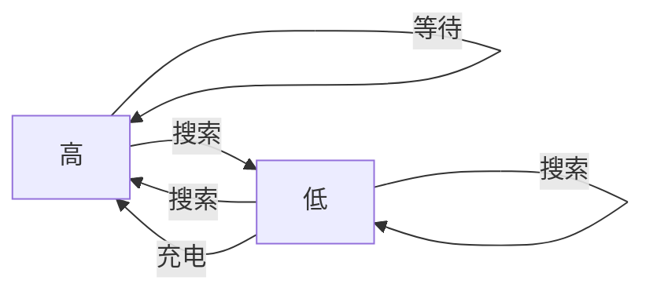

# Reinforcement  Learning An Introduction

## 
第三章

### Exercise3.4

请针对p(s',r|s,a)，给出一个类似于例3.3中的表格。它应该有对应的s,a,s',r和p(s',r|s,a)列，并且每个p(s',r|s,a)>0的四元组都有对应的行。

| s    | a        | s' | r                  | p()       |
| ---- | -------- | :-----------: | ------------------ | --------- |
| high | search   |     high      | rsearch | &alpha;   |
| high | search   |      low      | rsearch | 1-&alpha; |
| high | wait     |     high      | rwait   | 1         |
| low  | recharge |     high      | 0                  | 1         |
| low  | search   |     high      | -3                 | 1-&beta;  |
| low  | search   |      low      | rsearch | &beta;    |
| low  | wait     |      low      | rwait   | 1         |

### Exercise3.5

$$
\sum_{s'\in S}\sum _{r\in R} p(s',r|s,a)=1 \tag1
$$

**上述等式（即书上3.3）只适用于持续性任务的情况，需要少量修改才能适用于分幕式任务。请修改使其适用于分幕式任务。**
$$
\sum_{s'\in S^{+}}\sum_{r \in R}P(s',r|s,a)=1
$$

### Exercise3.6

**设杆平衡视为一个使用折扣的分幕式任务，当失败时收益为-1，否则为0，那么每次的回报多少？这个回报和使用折扣的持续任务有什么不同？**
$$
G_{t}=-\gamma^{T-t}\\
因为根据公式G_{t}=R_{t+1}+\gamma R_{t+2} \dots,除了最后一次收益为-1其余都为0
$$

### Exercise3.7

**假设你正在设计一个走迷宫机器人，从迷宫逃脱收益为+1，其余为0，这个任务可以很自然地被分解成幕，经过一段时间，机器人的逃脱能力不再增加。可能出什么问题？**

机器人进入了某个循环，需要其他策略

### Excercise3.8

**设&gamma;=0.5，T=5，接到的收益序列为R1=-1,R2=2,R3=6,R4=3,R5=2,那么G0,G1 ...G5分别是多少**
$$
G_{5}=0,\\
G_{4}=\frac{1}{2^4}R_{3}+G_{5},\\
G_{3}=\frac{1}{2^3}R_{4}+G_{4}\\
G_{2}=\frac{1}{2^2}R_{3}+G_{3},\\
G_{1}=\frac{1}{2}R_{2}+G_{2},\\
G_{0}=R_{1}+G_{1}
$$

### Exercise3.9

**设&gamma;=0.9收益序列是首项R1=2的无限T循环序列即（R2=R3=...7）那么G1和G0分别是多少？**
$$
\begin{align}
&G_{1}=7*\frac{\gamma}{1-\gamma}\\
&G_{0}=2 + 7*\frac{\gamma}{1-\gamma}
\end{align}
$$

### Exercise3.10

$$
试证明G_{t}=\sum_{k=0}^{\infty}\gamma^{k}=\frac{1}{1-\gamma}
$$

$$
\begin{align}
证：&S_{N}=\sum_{i=0}^{N}\gamma^{i}\\
&\gamma S_{N}-S_{N}=\gamma^{N+1}-1\\
&S_{N}=\frac{1-\gamma^{N+1}}{1-\gamma}\\
&S = \lim_{n\to \infty}S_{N}=\frac{1}{1-\gamma}
\end{align}
$$

### Exercise3.11

**如果当前状态试St,并根据随机策略&pi;选择动作，那么如何用&pi;和四参数函数P来表示Rt+1的期望**
$$
E_{\pi}[R_{t+1}|S_{t}=s]=\sum_{a}\pi(a|s)\sum_{s',r}rp(s',r|s,a)
$$

### Exercise3.12

**写出用q&pi;和&pi;来表示的V&pi;公式**
$$
V_{\pi}=\sum_{a\in \mathcal{A}}\pi(a|s)q_{\pi}(s,a)
$$

### Exercise3.13

**写出用V&pi;和四参数函数P表达的q&pi;公式**
$$
q_{\pi}(s,a)=\sum_{s',r}p(s',r|s,a)[r+\gamma v_{\pi}(s')]
$$

### Exercise3.14

**例3.5中图3.2（右）所示价值函数v&pi;的每个状态都满足贝尔曼方程（3.14）证：当周围四个相邻状态价值为2.3，0.4，-0.4，0.7时中心价值函数为0.7**
$$
\begin{align}
V_{\pi}(center)&=\sum_a{\pi(a|s)\sum_{s',r}p(s',r|s,a)[r+\gamma V_{\pi}(s')]}\\
&=\frac{1}{4}*0.9*3.0\\
&=0.675
\end{align}
$$

### Exercise3.16

**现在考虑走迷宫之类的分幕式任务中，把所有的收益都加上一个常数c,这 会对结果产生影响吗？**
$$
G_{t}\mid \rightarrow G_{t}+c \frac{1-\gamma^{T}}{1-\gamma}
$$

### Exercise3.17

**q&pi;的贝尔曼方程式什么？**
$$
\begin{align}
q_{\pi}(s,a)=&E_{\pi}[R_{t+1}+v_{\pi}(s')|s_{t}=s,A_{t}=a]\\
=&\sum_{s',r}P(s',r|s,a)[r+V_{\pi}(s')]
\end{align}
$$

### Exercise3.23

**给出回归机器人中，q*的贝尔曼方程**
$$
q_{*}(s,a)=\sum_{s',r|s,a}p(s',r|s,a)[r+\gamma \max_{a'}q_{*}(s',a')]
$$

### Exercise3.25

**用含有q*的等式来表示V\***
$$
V_{*}(s)=\sum_{a \in \mathcal{A}}\pi^{*}(a|s)q_{*}(s,a)
$$

### Exercise3.26

用含有V*等式来表示q\*
$$
\begin{align}
q_{*}(s,a)=&E[R_{t+1}+\gamma V_{*}(S_{t+1})|S_{t}=s,A_{t}=a]\\
=&\sum_{s',r}(r+\gamma V_{*}(s'))p(s',r|s,a)
\end{align}
$$

### Exercise3.27

**用含有q*的等式来表示&pi;\***
$$
\pi_{*}(a|s)=\frac{\prod{\{\underset {a}{\operatorname {arg\,max}} ,q_{*}(a',s)\}}}{\sum_{a}\prod{\{a=\underset {a'}{\operatorname {arg\,max}}\}}q_{*}(a',s)}
$$
