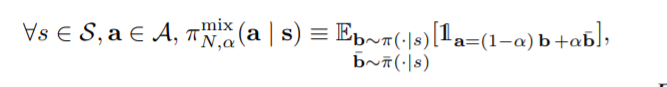

# 
论文笔记

# 摘要

在工作中我们格式化两个鲁棒标准来不确定地行动，我们考虑两个具体的方案，智能体会尝试动作a，(i)在概率&alpha;的情况下，另一个对抗性动作a'被执行，或者(ii)对手给连续动作空间中的选定动作。我们展示的是，我们的标准和机器领域中的不确定性十分相似，如力的突然出现和在表格的情况下建议算法。根据建议的算法，我们总结我们的DRL方法，在多样的Mujoco领域中提供扩展实验，我们的实验展示了不只有我们的方法提供鲁棒 策略，也可以在没有扰动的情况下提高性能。这个概述表示，动作鲁棒可以被认为是一个RL问题的隐形的规范。

# 介绍

最近RL研究已经证明了他对现实世界的潜力。因为在RL中，通常假设训练和试验域是相同的，一个学习策略在小的扰动下会怎么变化是不清楚的。

之前鲁棒MDPS已经在理论方面被扩展分析了。然而，正如这些工作分析的不确定性的过渡概率：(i) 如何克服这些不确定性是不清楚的，(ii)这些方法是否也许可以扩展到非线性的近似方法（神经网络）也是不确定的。最近，这些方法已经被经验解决了。当这些这些方法似乎在训练中干的很好，他们需要一个模拟器的访问和控制，并且没有理论上的保证——这是对抗性训练中的一个众所周知的问题。

我们的方法通过引入一种健壮性的自然方法来解决这些问题，健壮性行为扰动，一个方案（智能体由于扰乱，执行一个动作）。在这个工作在，我们考虑两个不同的健壮标准：根据策略提供一个动作(i):概率作用鲁棒MDP（PR-MDP，第3节）准则考虑了概率α，一个不同的概率对抗动作。(ii) NR-MDP Section4 准则，一些干扰放入了动作中。这两个准则与现实生活中的不确定性强烈相关，前者与突然的干扰有关，比如突然的推动，而后者则与持续的干扰力有关。如，如果机器人更重了，这会被看作一个对立面的对抗力量。

在第六章中，我们扩展方法到DRL，表现扩展评价到几个MUJoco环境中，展示了他提供强力策略的能力。我们具体地分析了PR-MDP和NR-MDP方法，证明了他们在干扰和不确定下地提供健壮策略地能力。惊喜的是我观察到令人惊讶的是，我们观察到即使在没有扰动的情况下，动作稳健性准则可提高性能。

# 结论

我们提出了两个健壮性的两个新的准则，PR-MDP和NR-MDP，都与现实生活中不确定的方案有关，讨论了两个方法理论上的不同。另外，我们发展了Soft PR-RI算法，我们提出了一个深度强化学习算法，能够解决我们的标准。我们比较了两种准则，分析了各种超参数如何影响行为，和如何用理论方法与经验主义相关联。最重要的的，我们注意到，不仅用我们的准测来训练在鲁棒策略中，而且方法在缺少扰动的情况下改变了表现。

最后，为了解决一个行为鲁棒性策略，没有必要提供不确定性集。该方法只需要一个标量值，即α（或者一个概率状态），它隐含地定义了一个不确定性集。

这是与标准的鲁棒策略相比比较突出的优势，在RL和控制中，据我们所知，需要对模型或扰动进行分布。当然，这种收益也是一种限制-这个动作健壮方法是不能解决任何一种坏情况干扰。还，因为他简单论证性能，这是一个值得算法设计者考虑的问题。

# 实验结论

图二展示了我们的结果，在各种MuJoCo领域中。很明显在Hopper-v2领域中，PR-MDP比NR-MDP表现好，但这不在所有的领域中奏效。此外，两个算法几乎在所有领域都表现得比基线好。但是优化参数可能区分不同德领域。我们的结果展示，在大部分案例中，参数跨域传输，无需额外调整即可提高性能。

**误差 :**同样重要的是要确认我们的算法没有超过基线的情况。这样的例子是反相器-管系域，其中PR-MDP的性能低于其非鲁棒计数器。我们发现对这个现象的两个可能的解释是(i) 这个参数整定在Hopper领域中表现得更好。因为各个领域是不同得，合理得解释是好的超参数在一个领域不能在所有得领域表现得好。(ii)特别是在反相器端部域中，任务是平衡一个极点，一个太强的对手会阻止代理成功地解决任务。

# 深入探究

我们尝试通过问两个问题(i)性能的提高是由于来自对手的附加扰动，还是操作本身导致了策略的先验性，例如正则化，从而导致性能的提高(ii) 经验行为与理论上的对应行为有多接近，来分析图3中我们标准的行为

**离线行为健康性:**在之前的实验中，在训练时，这项行动是根据代理人和对手的共同政策采取的，PR和NR-MDP方法中规定了联合政策。

一个自然的替代方法是设置表演策略，为了在离线fashion中，获得一个行动健壮性规则。意味着，在不受敌方影响的情况下获取数据，使用相同的算法。一个可能的方法的可能收益是最小化了坏行为的数量，但仍然受益于强大的学习能力。

图三显示了这个实验的结果。对于NR-MDP，似乎是操作员本身，训练导致表现有所改善，而对抗性的探索只是增加了一点稳定性。惊讶的是，相反的效果被PR-MDP观察到了。为了实现性能的提高，需要将对抗性探测和操作者相结合。

# 零和博弈

有两个玩家1,2，这个游戏的值函数被定义为
$$
\begin{align}
&\forall s \in S,v^{\pi \bar{\pi}}(s)\equiv E^{\pi,\bar{\pi}}[\sum^{\infty}_{t=0}\gamma^tr(s_t,a_t,\bar{a}_{t})|s_0=s]\\
v^*&=\max_{\pi\in P(\prod)}\min_{\bar{\pi}\in\prod}E^{\pi,\bar{\pi}}[\sum^{\infty}_{t=0}\gamma^{t}r(s_t,a_t,\bar{a}_t)|s_0=s],\\
&=\min_{\bar{\pi}\in P(\prod)}\max_{\pi\in\prod}E^{\pi,\bar{\pi}}[\sum^{\infty}_{t=0}\gamma^tr(s_t,a_t,\bar{a}_t)|s_0=s]
\end{align}
$$
注意，在一般情况下，最优最大化策略是从随机策略集中选择的

# PR-MDP

我们将PR-MDP中最大代理的最优策略称为最优概率鲁棒策略。此外，我们建立了博弈有一个明确的值，并分析了这个判据的一些性质。最后，我们制定了PI来解决PR-MDP问题，说明它们继承了与单代理PI方案相对应的属性。

**定义:**
$$
\alpha\in[0,1],\pi,\bar{\pi}是一对对手。我们定义他们共同策略的概率为\pi^{mix}_{P,\alpha}(\pi,\bar{\pi})\\\forall s\in S,\pi^{mix}_{P,\alpha}(a|s)\equiv(1-\alpha)\pi(a|s)+\alpha\bar{\pi}(a|s)\\
\pi的价值函数为v^{\pi}_{P,\alpha}=\min_{\bar{\pi}\in\prod}E^{\pi^{mix}_{P,\alpha}(\pi,\bar{\pi})}[\sum_t\gamma^tr(s_t,a_t)],a_t 近似于\pi^{mix}_{P,\alpha}(\pi(s_t),\bar{\pi}(s_t))。\\最优概率鲁棒策略是PR-MDP的最优策略\\
\pi^*_{P,\alpha}\in argmax _{\pi\in P(\prod)}min_{\bar{\pi}\in \prod}E^{\pi^{mix}_{P,\alpha}(\pi,\bar{\pi})}[\sum_t\gamma^tr(s_t,a_t)]\dots(1) \\ 
最优的鲁棒概率函数为v^*_{P,\alpha}=v_{P,\alpha}^{\pi^*_{P,\alpha}}
$$
简单地说，最优的概率鲁棒策略是最优的w.r.t.在这种情况下，一个对手在概率α下控制并执行最坏的可能行动。这种方法将无法控制系统和执行所需操作的可能性正式化。

为了获得最优概率鲁棒策略，需要解决零和问题。众所周知，任何零和博弈在随机策略集上都有一个明确的值，但并不总是在确定性策略上。有趣的是，与常规MDP类似，PR-MDP的最优策略是一个确定性的策略，正如下面的命题所断言的那样。

**命题1：**PR-MDP，存在一个最优化策略，确定性和强的二元性
$$
\begin{align}
v^*_{P,\alpha}&=\max_{\pi\in\prod}\min_{\bar{\pi}\in\prod}E^{\pi^{mix}_{P,\alpha}(\pi,\bar{\pi})}[\sum_t\gamma^tr(s_t,a_t)]\\
&=\min_{\pi\in\prod}\max_{\bar{\pi}\in\prod}E^{\pi^{mix}_{P,\alpha}(\pi,\bar{\pi})}[\sum_t\gamma^tr(s_t,a_t)]\\
\end{align}
$$

# Probabilistic Action Robust and Robust MDPs

虽然PR-MDP的方法看起来可能与健壮MDP的方法是正交的，但前者是后者的一个特例。利用PR-MDP准则，隐式地定义了一类模型，其中概率鲁棒策略是最优的w.r.t.模型。

要查看等效性，请定义以下类型的模型，

**命题1**
$$
\begin{align}
P_{\alpha}&=\{(1-\alpha)P+\alpha P^{\pi}:P(\prod)\}\\
R_{\alpha}&=\{(1-\alpha)r+\alpha r^\pi:\pi\in P(\prod) \}
\end{align}
$$
求解（1）的概率稳健策略也是以下RMDP的解决方案，
$$
\pi^*_{P,\alpha}\in argmax_{\pi'\in\prod}\min_{P\in P_{\alpha},r \in R_{\alpha}}E_{P}^{\pi'}[\sum_t\gamma^tr(s_t,a_t)]
$$
 E是策略的期望。

# PR-MDP的策略迭代

在这章中，我们分析了PI，虽然值迭代过程很容易推导出来，但我们任然注重可能的PI方案，PI方案是目前连续控制中常用的actor-critical方法的核心。我们展示了两个策略，PR PI 和soft PR PI,之后他了他们的联系。

概率鲁棒PI（PR-PI，算法1）是一种两人PI方案，用于求解PR-MDP问题。PR-PI重复两个阶段(i)给了一个固定的敌对策略，计算出最优计数策略(ii)解决了一部贪心策略w.r.t代理人价值与对手混合策略

Soft PR-RI使用梯度信息更新，不像PR-RI，不使用一步贪婪更新更新对手策略，而是使用Frank Wolfe更新更新对手策略。Franke-Wolfe更新，类似于梯度投影方法，找到一个在可行策略集合内的策略；例如，梯度可能会从单纯形中产生策略。它的工作原理是找到与梯度下降方向相关度最高的有效策略，即内积，并向它前进一步。由于两个策略的凸混合是一个有效策略，所以新策略被保证是有效的

尽管这两个算法似乎分离了，soft PR-PI只是将PR-PI的“硬”更新概括为“软”更新。这个状态在接下去的阶段被正式化了，

**命题2** 
$$
\pi,\bar{\pi} 为常规策略\\
argmin_{\bar{\pi}'\in\prod}r^{\pi'}+\gamma P^{\bar{\pi}'}v^{\pi^{mix}_{P,\alpha}(\pi,\bar{\pi})}\\
=argmin_{\pi'\in\prod}<\pi',\nabla_{\bar{\pi}}v^{\pi^{mix}_{P,\alpha}(\pi,\bar{\pi})}|\tilde{\pi}=\bar{\pi}>
$$
请注意，第一个单代理，一步改进，在一组确定性策略中有一个解决方案（因为操作空间是一个紧集，并且参数在操作中是连续的）。因此，算法2中的π′正是算法1中使用的一步贪婪策略。这表明，对于η=1，算法2与算法1完全等价。通过，在两人PI中，改进阶段相当于解决一个最大-最小、一步式的决策问题。在PR-PI中，情况显然不是这样；在改进阶段，解决了单代理、一步贪婪策略。解决后者比解决前者更容易，这是PR-MDP的特定结构的结果，而这种结构一般不成立。

**命题3**
$$
v_k=v^{\pi^{mix}_{P,\alpha}(\pi_{k},\bar{\pi}_k)},\forall \eta\in(0,1]\\在算法2中，v_k合同v^*_{P,a}带系数(1-\eta+\gamma\eta)\\
||v_k-v^*_{P,\alpha}||_{\infty}\le(1-\eta+\gamma\eta)||v_{k-1}-v^*_{P,\alpha}||_{\infty}
$$
由于算法1和2的等价性（当η=1时），我们得到PR-PI收敛到唯一的纳什均衡。

**评论1**

算法1和算法2的argmax,argmin的解决方法可以被交换。
$$
\begin{align}
算法1:
&Initialize: \quad\alpha,\bar{\pi},k=0\\
&while \ not \ changing \ do\\
&\quad \pi \in argmax_{\pi'}v^{\pi^{mix}_{P,\alpha}(\pi',\bar{\pi}_k)}\\
&\quad \bar{\pi}_{k+1}\in argmin_{\bar{\pi}}r^{\bar{\pi}}+\gamma P^{\bar{\pi}}v^{\pi^{mix}_{P,\alpha}(\pi_k,\bar{\pi}_k)}\\
&\quad k \leftarrow k+1\\
&end \ while\\
&Return \ \pi_{k-1}
\end{align}
$$

$$
\begin{align}
算法2:
&Initialize: \quad\alpha,\bar{\pi},k=0\\
& while\  criterion\  is \  not \ satisfied\ do\\
& \quad \pi_k\in argmax_{\pi'}v^{\pi^{mix}_{P,\alpha}(\pi',\bar{\pi}_k)}\\
&\quad \bar{\pi} \in argmin_{\bar{\pi}}<\bar{\pi}',\nabla_{\bar{\pi}'}v^{\pi^{mix}_{P,\alpha}(\pi',\bar{\pi})}|\bar{\pi}=\bar{\pi}_k>\\
&\quad\bar{\pi}_{k+1}=(1-\eta)\bar{\pi}_k+\eta \bar{\pi}\\
&\quad k\leftarrow k+1\\
&end \ while\\
&Return \ \pi_{k-1}
\end{align}
$$
**评论2**

尽管软PR-PI比非软PR-PI收敛速度慢，但可以合理地假设前者对错误的敏感性低于后者。软PR-PI可以看作是保守PI（CPI）求解PR-MDPs的推广。众所周知，CPI比其他PI方案对误差的敏感性较低。尽管如此，PR-PI的错误分析与消费者物价指数有很大不同。在软PR-PI中，对抗策略小的改变可能导致智能体策略的巨大变化。因此，测度ν下的γ加权态占有率v
$$
d_{P,\alpha}^{mix}(\pi_k,\bar{\pi}_k)=\sum_t\gamma^tvP^{\pi^{mix}_{P,\alpha}(\pi_k,\bar{\pi}_k)}
$$
可能在迭代之间发生巨大变化，而在CPI中，变化是平滑的。

# NR-MDP

我们考虑一个动作空间的扰动而不是策略空间的扰动。为了正式学习这个一个扰动，我们定义为NR-MDP，与PR-MDP相似，可以被视为一个零和游戏。我们继续建立这个MDP的一些属性，同时强调与PR-MDP方法相关的重要差异。

**定义2**

$$
对于NR-MDP，值被定义为v^{\pi}_{N,\alpha}=min_{\bar{\pi}\in\prod}E^{\pi^{mix}_{N,\alpha}(\pi,\bar\pi)}[\sum_t \gamma^tr(s_t,a_t)]\\
a_t \sim \pi^{mix}_{N,\alpha}(\pi(s_t),\bar{\pi}(s_t))
$$
最优α-噪声鲁棒策略是NR-MDP的最优策略
$$
\pi^*_{N,\alpha}\in argmax_{\pi\in P(\prod)}min_{\bar{\pi}\in \prod}E^{\pi^{mix}_{N,\alpha}(\pi,\bar{\pi})}[\sum_t\gamma^tr(s_t,a_t)]\\
最优的噪声鲁棒价值是v^*_{N,\alpha}=v_{N,\alpha}^{\pi*_{N,\alpha}}
$$
简单地说，一个最优的噪声鲁棒策略是最优的w.r.t.一种情况，在这种情况下，对手可以通过添加有界扰动来改变代理的行为,动作在系统上的表现为(1-&alpha;)a+&alpha;a(一八),对手增加扰动的能力是通过参数α来控制的。α的每个值定义了一个新的连续动作NR-MDP，当α=0时，敌方无法影响系统，决策问题将退化为标准的、非鲁棒的MDP公式。A的结构假设是必需的，为了保证α-混合行动是有效的，在连续控制领域中，一个自然成立的假设。这种方法形式化了动作空间中扰动的具体含义。

不像PR-MDP，存在一个确定性的平稳最优策略，通常来说，NR-MDP不是这样的。最优噪音策略是一个随机策略。

**命题4**

存在一个NR-MDP
$$
\max_{\pi\in\prod}\min_{\bar{\pi}\in\prod}E^{\pi^{mix}_{N,\alpha}(\pi,\bar{\pi})}[\sum_t\gamma^tr(s_t,a_t)]<\max_{\pi\in P(\prod)}\min_{\bar{\pi}\in\prod}E^{\pi^{mix}_{N,\alpha}(\pi,\bar{\pi})}[\sum_t\gamma^tr(s_t,a_t)]
$$

# NR-MDP的策略迭代

具体地说，考虑重复以下两个阶段的两人零和PI
$$
\begin{align}
&1.\pi_k\in {\underset {x\in \pi}{\operatorname {arg\,max}}}v^{mix}_{N,\alpha}(\pi,\bar{\pi}_k)\\
&2.\pi_k\in {\underset {{\bar \pi}\in P(\prod)}{\operatorname {arg\,min}}}{\underset {x\in \prod} {\operatorname{max}}} r^{\pi_{N,\alpha}^{mix(\pi,\bar{\pi})}}+P^{\pi^{mix}_{N,\alpha}(\pi,\bar{\pi})}v^{\pi^{mix}_{N,\alpha}(\pi_k,\bar{\pi}_k)}\\
&v^{mix}_{N,\alpha}(\pi,\bar{\pi}_k)是联合策略\pi^{mix}_{N,\alpha}的值\\
&r^{\pi_{N,\alpha}^{mix}(\pi,\bar{\pi})}(s)=E_{a\sim\pi,\bar{a}\sim \bar{\pi}}[r(s,(1-\alpha)a+\alpha\bar a)]\\
&P^{\pi_{N,\alpha}^{mix}(\pi,\bar{\pi})}(s,s')=E_{a\sim\pi,\bar{a}\sim \bar{\pi}}[P(s|s,(1-\alpha)a+\alpha\bar a)]\\
&对于NR-MDP，也可以获得类似的γ收缩结果
\end{align}
$$
在这种算法中，第（1）阶段是通过求解MDP来执行的，如PR-PI。然而,第（2）阶段需要解决一个1步最小-最大问题。对于一般的奖励和转移概率，它不能通过解决单个代理决策问题来解决，就像PR-PI（算法1）的第二阶段一样。此外，第（2）阶段的解决方案不能像命题2那样通过一次调用梯度预言机来实现。

# 实验

我们关注的是DDPG的一个健壮变体，我们称之为ActionRobust DDPG。在AR-DDPG中，我们训练两个网络，确定性策略，参与者和对手，用µθ和µ´θ´表示。类似于DDPG，评论家被训练来估计联合策略的qfunction。对于PR-MDP（定义1），联合政策为
$$
\pi_{P,\alpha}^{mix}(u|s;\theta,\bar{\theta}) = (1-\alpha)\delta(u-\mu_{\theta}(s))+\alpha\delta(u-\bar{u}_{\bar{\theta}}(s))\\
对于NR-MDP,联合策略是\\
\pi^{mix}_{N,\alpha}(u|s;\theta,\bar{\theta}=\delta(u-(1-\alpha)\mu_\theta(s)+\alpha\bar{\mu}_{\bar{\theta}}(s)))\\
其中δ（·）是狄拉克δ函数。

$$
**命题5**
$$
\pi(\mu_\theta,\bar{\mu}_{\bar\theta})是智能体和对手给的联合策略，\\PR-MDP\ \pi=\pi^{mix}_{P,\alpha}(3),NR-MDP\ \pi=\pi^{mix}_{N,\alpha}(4)\\
J(\pi(\mu_\theta,\bar\mu_{\bar\theta}))=E_{s\sim\rho^{\pi}}[v^{\pi}(s)]作为绩效目标\\
PR-和NR-MDP的梯度为\\
\nabla_{\theta}J(\pi(\mu_{\theta},\bar\mu_{\bar\theta}))=(1-\alpha)E_{s\sim\rho^{\pi}}[\nabla_\theta\mu_\theta(s)\nabla_aQ^\pi(s,a)]\\
\nabla_{\theta}J(\pi(\mu_{\theta},\bar\mu_{\bar\theta}))=\alpha E_{s\sim\rho^{\pi}}[\nabla_\theta\mu_\theta(s)\nabla_aQ^\pi(s,a)]\\
对于PR-MDP，我们有a=\mu_{\theta}(s)和\bar{a}=\bar\mu_{\bar\theta}(s)\\
对于NR-MDP,我们有a=\bar{a}=(1-\alpha)\mu_{\theta}(s)+\alpha\bar\mu_{\bar\theta}(s)
$$
我们的理论方法，软PR-PI（算法2）被证明是PR-MDP。该算法基于动态规划方法，（i）给定一个固定的对手策略，求解最优代理策略，（ii）使用梯度更新对手策略。

1.而在理论上，对于PR准则，存在一个确定性的最优策略-这不一定适用于NR情况（命题4）。因此，搜索确定性策略的空间是次优的。

2.理论方法通常需要精确计算，但在实际应用中，我们使用函数逼近方法，例如深层神经网络。因此，不能保证收敛，该方法应被视为一种启发式方法。

