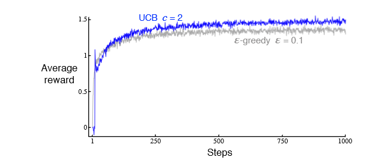
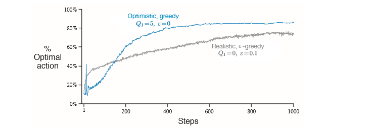

# Reinforcement  Learning An Introduction

## 
第二章

### Exercise2.1

**在  &epsilon;-贪心动作选择中，在有两个动作及 &epsilon;=0.5的情况下，贪心动作被选择的概率是多少？**

&epsilon;-贪心动作指的是，有&epsilon; 概率使用非贪心策略，那么都使用贪心的概率为
$$
1-0.5*0.5 = 0.75
$$

### Exercise2.2

**k=4的多臂赌博机，记为1，2，3，4。假设初始收益及动作最初顺序为 ，算法使用&epsilon;贪心动作选择，基于采样平均得动作价值估计初始估计Q1(a)=0,&forall;a。假设动作及收益得最初顺序是**
$$
A_{1}=1,R_{1}=-1,A_{2}=2,R_{2}=1,
A_{3}=2,R_{3}=-2,A_{4}=2,R_{4}=2,
A_{5}=3,R_{5}=0
$$
**在哪个时刻发生了&epsilon;情形, 使一个动作被随机选择。请回答，在哪些时刻中这种情形肯定发生了？ **

A2和A5完全是探索的,其他可能是探索

(我觉得是A3和A5,因为A3时刻，action2收益率最低，但它还继续选择了action2)

### EXercise2.3

**从累计收益和 选择最佳动作可能性&epsilon;=0.01和&epsilon;=0.1哪个长时期表现得好一些？**
$$
\epsilon=0.01表现得更好，因为两个情况下t\to\infty时，都有Q_{t}\to q_{*},\epsilon=0.01获取最优动作可能性比\epsilon比\epsilon=0.1高10倍
$$

### Exersice2.4

**如果步长参数&alpha;不为常数，一般情况下，对于这样得步长参数序列之间得每一次收益得步长分别是多少？**
$$
\begin{align}
Q_{n+1} = &Q_{n}+\alpha[R_{n}-Q_{N}]\\
=&\alpha R_{n}+(1-\alpha)Q_{n}\\
=&\alpha R_{n}+(1-\alpha)[\alpha R_{n-1}+(1-\alpha Q_{n-1})]\\
=&\alpha R_{n}+(1-\alpha)\alpha R_{n-1} +(1-\alpha)^{2}Q_{N-1}\\
=&\alpha R_{n}+(1-\alpha)R_{n-1}+(1-\alpha)^{2}\alpha R_{n-2}+\dots+(1-\alpha)^{n-1}\alpha R_{1}+(1-\alpha)^{n}Q_{1}
\end{align}
$$

$$
\begin{align}
&\alpha_{0}=1\\
&Q_{n+1}=(\prod_{i=1}^{n}(1-\alpha_{i}))Q_{1}+\sum_{i=1}^{n}(1-\alpha_{k})
\end{align}
$$

### Exercise2.6

****

**上图中展示得结果应该是可靠得，因为它们是2000个独立随机选择得10臂赌博机任务得平均值。那么为什么乐观初始化方法在曲线得早期会出现震荡和峰值？换句话说，是什么使得这种方法在特定得早期步骤中变现得特备好或者特别糟？**

在第10步之后的某个时刻，智能体将找到最佳值，然后它会贪婪地选择这个值。小步长参数（相对于初始化值5较小）意味着最优值的估计值将缓慢收敛到其真实值。

这个真实值很可能小于5。这意味着，由于步长较小，其中一个次优操作的值仍将接近5。因此，在某个时刻，代理又开始以次优的方式行动。

### Exercise2.7

**本章得绝大多数案例中，我们使用采样平均来估计动作得价值，这是因为采样平均不会像恒定步长一样产生偏差，参见式（2.6）的分析，但是采样平均并不是完全令人满意的解决方案。在非平稳的问题中，它可能会表现很差。我们是否有办法利用恒定步长在非平稳过程中的优势，又能有效避免它的偏差呢？一种科可行的方法是利用如下的步长来处理某个特定动作的第n个收益**
$$
\beta=\alpha/\overline{o}_{n}
$$
**其中&alpha;>0是一个传统的恒定步长，on是从零开始计算的修正系数**
$$
\overline{o}_{n}=\overline{o}_{n-1}+\alpha(1-\overline{o}_{n-1}),对于n\geq0,满足 \overline{o}_{n}=0.
$$
**通过与式子（2.6）类似的分析方法，试证明Qn试一个对初始值无偏的指数近因加权平均。**

考虑练习2.4的答案。当k>1时，Qk与Q1无关，因为β1=1。现在我们需要说明的是，随着我们进一步回顾过去，剩余和中的权重会减少。
$$
\omega_{i}=\beta_{i}\prod_{k=i+1}^n(1-\beta_{k})
$$
随着固定n的i增加。对此，请注意
$$
\frac{\omega_{i+1}}{\omega_{i}}=\frac{\beta_{i+1}}{\beta_{i}(1-\beta_{i+1})}=\frac{1}{1-\alpha}>1
$$
我们假设&alpha;<1。如果&alpha;=1那么&beta;t=1&forall;t

### Exercise2.8

**UCB在第11步时有一个明显的尖峰（10臂），为什么？提示：如果c=1，那么这个尖峰就不会那么突出了**

$$
A_{t}=argmax[Q_{t}(a)+c\sqrt{\frac{ln(t)}{N_{t}(a)}}]
$$
因为前10步，代理循环了所有操作，当Nt(a)=0时。A被视为最大值，第11步会进行贪婪选择，直到ln(t)>Nt(a)才进行其他行动，这样智能体会开始探索，减少了奖励。